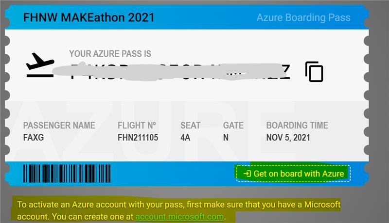
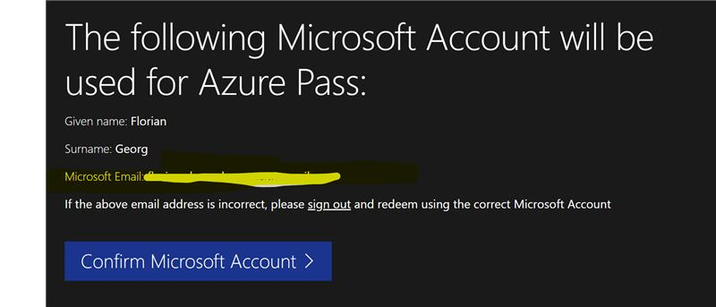
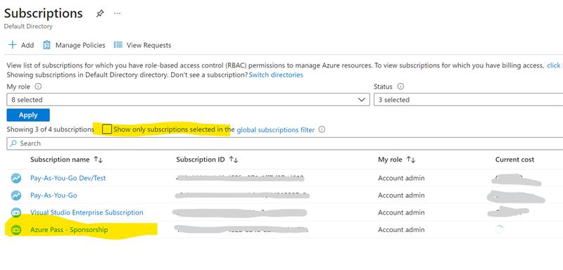

# ABB Energy Efficiency Startup Challenge 2022 - Azure Quickstart Guide

## Event Overview
- Event page: https://www.collaborateandcommercialize.com/
- Challenges: 
  - https://www.collaborateandcommercialize.com/abbee2022-else
  - https://www.collaborateandcommercialize.com/abbee2022-mose
  
## Your Microsoft contacts
- Andrew Reid (https://www.linkedin.com/in/andrewfreid/)
- Dennis von Onselen (https://www.linkedin.com/in/dennisvanonselen/)
- Florian Georg (https://www.linkedin.com/in/fgeorg/)
- Giovanna Dughera (https://www.linkedin.com/in/giovanna-dughera/)
- Stefan Fischer (https://www.linkedin.com/in/stefan-fischer/)

## Getting Started with Microsoft Azure
If you want to get the best Developer experience, you'll need to following:
- GitHub account (https://github.com)
- Microsoft Azure account (https://portal.azure.com) 

You can also log-in to Azure using your existing __GitHub account__

### Never used Azure before?
We recommend: https://docs.microsoft.com/en-us/learn/modules/azure-architecture-fundamentals/

### Used other cloud platforms before?
- Azure for AWS Professionals: https://learn.microsoft.com/en-us/azure/architecture/aws-professional/
- Azure for GCP Professionals: https://learn.microsoft.com/en-us/azure/architecture/gcp-professional/

__Hint__: 
If English is not your first language, try changing `/en-us/` to `/de-de/` (for example). Works for most `*.microsoft.com` pages, including docs and learn tutorials.

## Get Free Azure Credits (Azure Passes)
We provide __200$ / 90-days__ free credits, so that you can use Azure for free on your prototype. 
These "Azure Passes" come in the form of __promo codes__ and need to be redeemed on a special website. Afterwards you should get an __Azure Sponsored Subscription__ in your account.

__Important__: You only need ONE per team. If needed, you can give permissions to your resources to other users of your team.

* Go to: __https://azcheck.in/abb221015__
* Copy the voucher code and then click “=> Get on board with Azure”

* You will get forwarded to the website https://www.microsoftazurepass.com/
* Click “Start” and follow the process
* Double-check you are using the right Microsoft account, in case you have multiple.

* The process should forward to the Azure Portal after a few minutes. You should now be able to find the sponsored Subscription.

## Essential Links

- Azure Web Portal:  https://portal.azure.com
- Microsoft Docs (tech docs): https://docs.microsoft.com/en-us/
- Microsoft Learn (Tutorials etc): https://docs.microsoft.com/en-us/learn/
- Azure Charts (with links to docs): https://azurecharts.com/links

- Channel9 (Video and live events): https://channel9.msdn.com/
- Microsoft Developer @ YouTube: https://www.youtube.com/c/MicrosoftDeveloper

- Microsoft Certifications: https://docs.microsoft.com/en-us/learn/certifications/

    - https://docs.microsoft.com/en-us/learn/certifications/azure-fundamentals/
    - https://docs.microsoft.com/en-us/learn/certifications/azure-data-fundamentals/
    - https://docs.microsoft.com/en-us/learn/certifications/azure-ai-fundamentals/
    - https://docs.microsoft.com/en-us/learn/certifications/security-compliance-and-identity-fundamentals/

- StackOverflow: https://stackoverflow.com/questions/tagged/azure

## Autonomous Systems and AI in Energy
Two areas for Microsoft solutions you might have a deeper look at:
- Autonomous Systems: https://www.microsoft.com/en-us/ai/autonomous-systems 
- AI in Energy: https://www.microsoft.com/en-us/ai/industry/ai-in-energy 

## Choose your Azure Services
Depending on what technology and frameworks you want to use, here're some recommendations to get started.

__Documentation Overview__ (all services): https://docs.microsoft.com/en-us/azure/?product=featured

### Web Apps and APIs
- __Azure App Service__:  Azure App Service enables you to build and host web apps, mobile back ends, and RESTful APIs in the programming language of your choice without managing infrastructure.
  - Docs: https://docs.microsoft.com/en-us/azure/app-service/
  - Learn module: https://docs.microsoft.com/en-us/learn/modules/host-a-web-app-with-azure-app-service/

- __Azure Static Web Apps__: allows you to build modern web applications that automatically publish to the web as your code changes. Full-stack development combining Frontend (React, Angular, Vue, ...), Serverless Backend API using Azure Functions (NodeJS, Python, C#,...) and GitHub Actions CI/CD pipeline. 
    - Video: https://channel9.msdn.com/Shows/Docs-Azure/Building-and-Deploying-a-Static-Web-App/
    - Docs: https://docs.microsoft.com/en-us/azure/static-web-apps/overview
    - Learning Path: https://docs.microsoft.com/en-us/learn/paths/azure-static-web-apps/

- __Azure Functions__ (Serverless): You can use Functions to build web APIs, respond to database changes, process IoT streams, manage message queues, and more.
  - https://docs.microsoft.com/en-us/azure/azure-functions/

**Note:** we recommend using __GitHub Actions__ as CI/CD pipeline.
Learn more here: 
https://docs.microsoft.com/en-us/learn/modules/github-actions-cd/

### Databases and Storage
Azure Database services: 
https://docs.microsoft.com/en-us/azure/?product=databases

- __Azure Blob storage__: Store unstructured objects, e.g. images, documents etc):
https://docs.microsoft.com/en-us/azure/storage/blobs/

- __Azure Cosmos DB__: Fast NoSQL database, multiple APIs e.g. Gremlin (Graph), SQL, MongoDB, Cassandra, Table Storage
  -  https://docs.microsoft.com/en-us/azure/cosmos-db/

### Autonomous Systems
- Microsoft Autonomous Systems: https://www.microsoft.com/en-us/ai/autonomous-systems
- Microsoft Bonsai (Low-Code Deep Reinforcement Learning): https://docs.microsoft.com/en-us/bonsai/
- Coursera Course "Machine Teaching AI": https://www.coursera.org/learn/machine-teaching-ai

### Machine Learning and Data Science
Solutions for Advanced Data Analysis with Python, MLOps etc.

- __Azure Machine Learning__: Train, test deploy your Machine Learning Models
- ML Studio: https://ml.azue.com
- Docs: https://docs.microsoft.com/en-us/azure/machine-learning/

- __Azure Databricks__: Unified Analytics Platform.
https://docs.microsoft.com/en-us/azure/databricks/

### Cognitive Services and A.I.
These are APIs and Cloud tools you can use for building intelligent aplications.

- __Azure Applied AI Services__ 
  - Form Recognizer: Extract text from forms and documents
     - Docs: https://docs.microsoft.com/en-us/azure/applied-ai-services/form-recognizer/

  - Azure Cognitive Search: Build semanticly enriched, searchable document databases
    - Docs: https://docs.microsoft.com/en-us/azure/search/

- __Azure Cognitive Services__ Vision, Language, Speech 
  - Docs: https://docs.microsoft.com/en-us/azure/cognitive-services/

  - __Computer Vision__: OCR, Object detection, Image classification, Spatial Analysis ...
    - Docs: https://docs.microsoft.com/en-us/azure/cognitive-services/computer-vision/
    

  - __Language Service__: Text Analytics / Natural Language Processing, Text Classification, Translation, Language detection ...
    - Docs: https://docs.microsoft.com/en-us/azure/cognitive-services/language-service/
    - Language Studio: https://language.azure.com/
   

  - __Speech Service__: Speech-to-Text / Text-to-Speech, Translation, Transcription, Voice Assistants, Intent recognition...
- Docs: https://docs.microsoft.com/en-us/azure/cognitive-services/speech-service
    - Speech Studio : https://speech.microsoft.com/

- __Azure Maps__ : Maps, Search, Routing, Traffic, Weather, Time Zones, Geolocation, Geofencing, Map Data, Creator, and Spatial Operations
  - Docs: https://docs.microsoft.com/en-us/azure/azure-maps/

###  Azure SDKs and REST API
Most Azure Servies have SDK support for common languages (Python, JavaScript, C#, ...)

- Python:
  - SDK API Browser: https://docs.microsoft.com/en-us/python/api/?view=azure-python
- JavaScript / Node
  - SDK API Browser: https://docs.microsoft.com/en-us/javascript/api/?view=azure-node-latest

