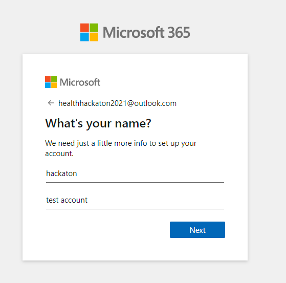
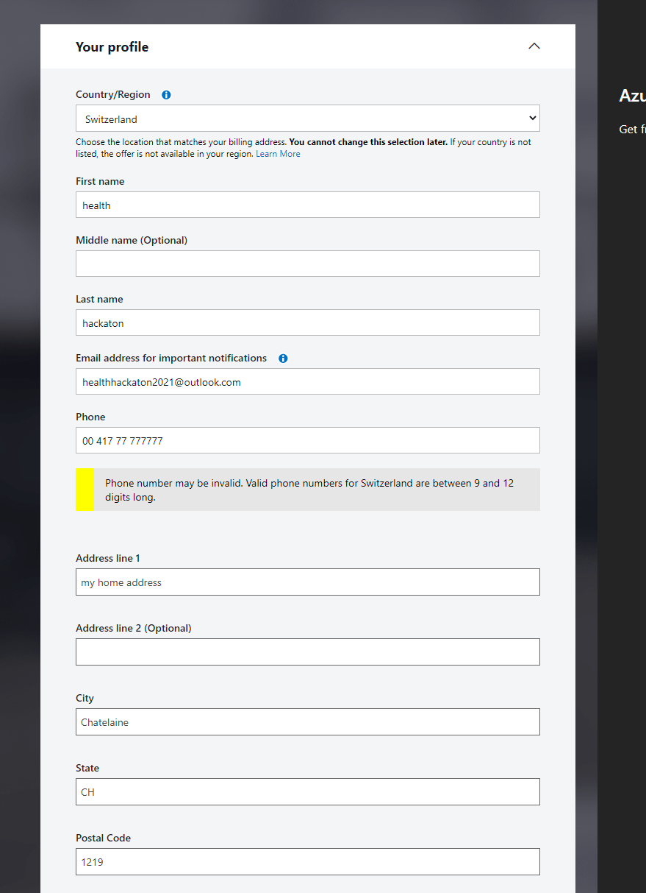

# How to create a Microsoft Trial environment for your Hack
In order to get access to all our Cloud services, including Microsoft Azure and Microsoft Power Platform, we need to setup our cloud accounts first.

In this section we are going to create: 

- Office 365 subscription 
- Azure Subscription 
- GitHub subscription 

All connected like in an enterprise. 

## Step 1: Create a Microsoft 365 account 

- Start a browser in **InPrivate Mode** 
- Visit this website: https://www.microsoft.com/en-us/microsoft-365/try
- Click on **Try one month free** 

- Then click on __Create one__

- The click on __Get a new email address__ 

- **Note:** The name is not really important (as it will not be your user account for office 365 in the end) but you need to remember it. 

Great, you have a new Microsoft M 365 account now.

## Step 2: Sign up for the Office 365 trial  

- Now, without closing the tab, navigate to: 
https://www.microsoft.com/en-us/microsoft-365/enterprise/office-365-e5?activetab=pivot%3aoverviewtab

- You need to provide a valid phone number to receive the code: 

- At this point, we are able to define our tenant name the first Office 365 (Admin) account 

 Now, your office 365 tenant is ready to be used! 

## Step 3: Create new GitHub account 
- Now you can create a **GitHub account** - **using the admin account you just created**. 

- Click on the Azure Pass link nad great the github account 

- You need to verify yourself accessing the email of ADMIN and adding the code. 

- Go to https://office.com and sign in with the admin account you create before and open Outlook 

 
 - Click on **Skip Personalization** 

 - Now, Login in the previous Tab using Github Account
 
 

## Step 4: Get and redeem your Azure Pass (= Free credits on Azure)

 - Now get your team's Azure Pass code at: 
   ## [https://azcheck.in/doh211113](https://azcheck.in/doh211113)

 - Click now on __Get on board to Azure__! 
  

 - Click on __Start__ and then Confirm the Microsoft Account 
   

 - Validate the Azure Pass code..  
  

 - Done! 
  

 

Now it's possible to create accounts for all the hackers in the team. 
 